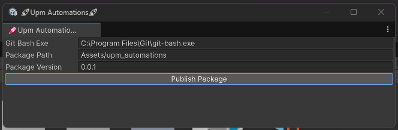

# Upm Automations 

### Press "Publish Package" and:
- all changes get commited
- specified version is written in commit message
- subtree is from specified Package Path created on upm branch and pushed
